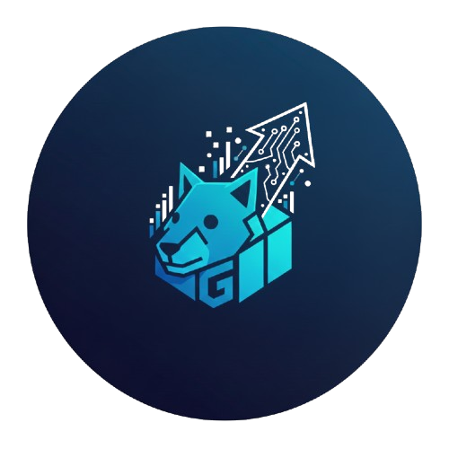

# GoContainerOps



A lightweight, real-time container monitoring dashboard written in Go and React. It connects to the local Docker socket to display CPU usage, memory consumption, network I/O, and block I/O for all active containers.

## ✨ Features

- **Real-time Monitoring**: View live metrics for all your running containers.
- **Detailed Stats**: Get detailed information on CPU, memory, network I/O, and block I/O.
- **Historical Data**: See the last 120 seconds of CPU, memory, and network I/O history for each container.
- **Interactive UI**: A modern and responsive user interface built with React and Chart.js, with zoom and pan functionality.
- **Container Processes**: View processes running inside each container.
- **Container Logs**: Access real-time logs for each container.
- **Filtering**: Filter containers by name, image, and status.
- **Easy to Use**: Get up and running with a single command.

## 📂 Folder Structure

```
gocontainerops/
├── main.go               # Go backend: fetches stats from Docker API
├── go.mod                # Go module definitions
├── go.sum                # Go module checksums
├── Dockerfile            # Multi-stage Docker build file
├── docker-compose.yml    # Container orchestration & socket mounting
├── Makefile              # Shortcuts for building and running
├── internal/             # Internal Go packages
│   ├── container/        # Container-related logic (model, processor)
│   │   ├── model.go      # Defines container data structures
│   │   └── processor.go  # Processes container metrics
│   ├── docker/           # Docker client and service interactions
│   │   ├── client.go     # Docker API client
│   │   └── service.go    # Docker service implementation
│   └── handler/          # HTTP handlers for the API
│       └── handler.go    # Defines API endpoints and logic
└── frontend/             # React frontend application
    ├── src/              # Source code for the React application
    │   ├── App.jsx       # Main application component
    │   ├── components/   # Reusable React components
    │   │   ├── ContainerCard.jsx  # Displays individual container stats
    │   │   ├── Dashboard.jsx      # Main dashboard layout
    │   │   ├── DetailedView.jsx   # Detailed view for a single container
    │   │   └── StatCard.jsx       # Generic card for displaying statistics
    │   └── ...           # Other frontend source files (CSS, main.jsx, assets)
    ├── package.json      # Defines frontend dependencies and scripts
    ├── package-lock.json # Records the exact dependency tree
    ├── vite.config.js    # Vite configuration with proxy settings
    └── ...               # Other frontend configuration and static assets
```

## 🚀 Getting Started

### Prerequisites

- [Docker](https://docs.docker.com/get-docker/)
- [Docker Compose](https://docs.docker.com/compose/install/)
- [Go](https://golang.org/doc/install) (1.21+) (Only if you want to build/run locally without Docker)
- [Node.js](https://nodejs.org/en/download/) (LTS version recommended) and [npm](https://www.npmjs.com/get-npm) (Only if you want to build/run frontend locally)

### Option 1: Run with Docker Compose (Recommended)

This is the easiest way to run the application, as it isolates the environment and handles dependencies automatically.

1.  **Start the application:**

    ```bash
    make up
    # OR
    docker-compose up --build -d
    ```

2.  **Open your browser:**

    Navigate to [http://localhost:8080](http://localhost:8080).

3.  **Stop the application:**

    ```bash
    make down
    # OR
    docker-compose down
    ```

### Option 2: Run Backend Locally (for Development)

If you have Go installed and want to run the binary directly on your host:

1.  **Install dependencies:**

    ```bash
    go mod tidy
    ```

2.  **Run the application:**

    ```bash
    go run main.go
    # OR
    make run
    ```

    **Note:** The application requires access to `/var/run/docker.sock`. On Linux/macOS, you might need `sudo` or your user must be in the `docker` group.

### Option 3: Run Frontend and Backend Separately (for Development)

This option is useful if you are actively developing both the frontend and backend and want to take advantage of hot-reloading for the frontend.

1.  **Start the Backend:**

    Follow the steps in "Option 2: Run Backend Locally" to start the Go backend. Ensure it's running and accessible.

2.  **Start the Frontend:**

    Navigate to the `frontend` directory and install dependencies, then start the development server:

    ```bash
    cd frontend
    npm install
    npm run dev
    ```

3.  **Open your browser:**

    The frontend development server will typically run on `http://localhost:5173` (or another port if 5173 is in use). The frontend is configured to proxy API requests to the backend running on `http://localhost:8080`.

## ⚙️ Makefile Commands

The `Makefile` provides convenient shortcuts for common development and Docker Compose operations:

*   `make up`: Builds (if necessary) and starts the services defined in `docker-compose.yml` in detached mode. It also prints the URL where the application is accessible.
*   `make down`: Stops and removes the containers, networks, and volumes created by `docker compose up`.
*   `make logs`: Displays the real-time logs from all services defined in `docker-compose.yml`.
*   `make run`: (Not explicitly in the provided Makefile, but implied by "Option 2") This would typically run the Go backend locally.

## 🛠 Tech Stack

- **Backend**: [Go](https://golang.org/)
- **Frontend**: [React](https://reactjs.org/), [Chart.js](https://www.chartjs.org/)
- **Build Tool**: [Vite](https://vitejs.dev/)
- **Containerization**: [Docker](https://www.docker.com/), [Docker Compose](https://docs.docker.com/compose/)

## 📡 API Endpoints

- `GET /`: Serves the dashboard.
- `GET /api/stats`: Returns a JSON array of currently running containers with real-time metrics.

## 🤝 Contributing

Contributions, issues, and feature requests are welcome! Feel free to check the [issues page](https.github.com/enricoconvento98/gocontainerops/issues).

## 📝 License

This project is [MIT licensed](https://github.com/enricoconvento98/gocontainerops/blob/main/LICENSE).
